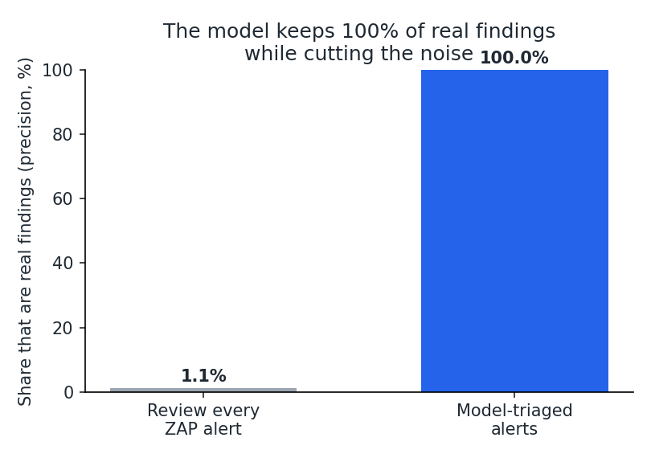
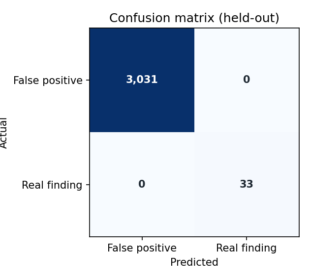
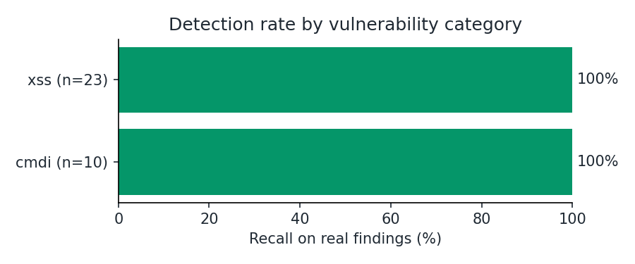
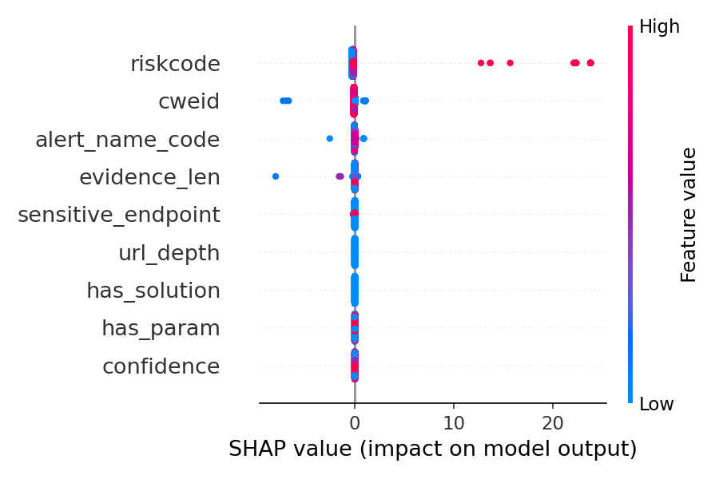
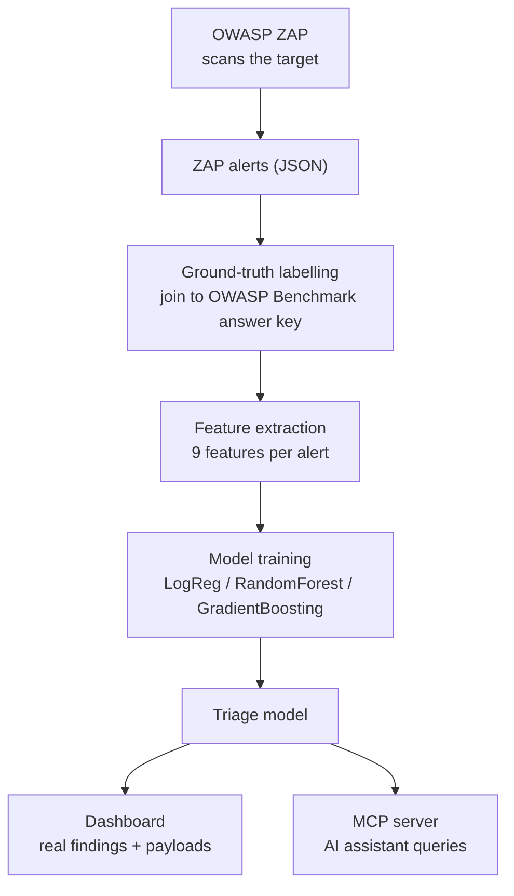
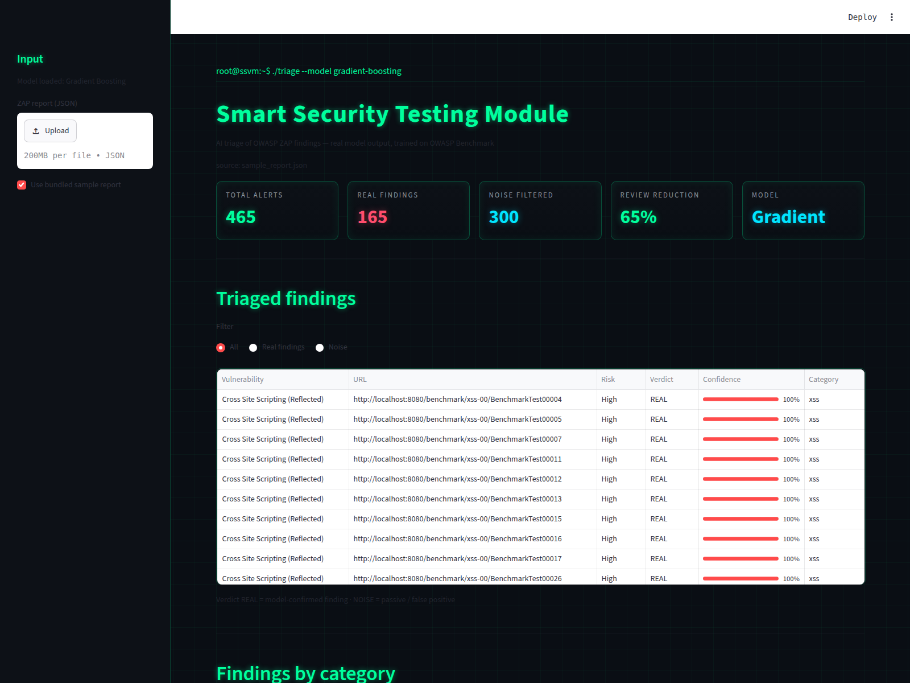

# Smart Security Testing Module

**AI-assisted triage for web-application scan results.** An OWASP ZAP scan of a
real target produces thousands of alerts, of which only a tiny fraction are real
exploitable findings. This project trains a model on the **OWASP Benchmark**
(2,740 ground-truth-labelled test cases) to surface the real findings out of the
noise, explains each decision, suggests re-verification payloads, and serves it
all through a dashboard and an MCP server for an AI assistant.

[](https://www.python.org/)
[](https://scikit-learn.org/)
[](https://www.zaproxy.org/)
[](https://owasp.org/www-project-benchmark/)
[](https://modelcontextprotocol.io/)
[](LICENSE)

---

## The problem

Run ZAP against OWASP Benchmark and it returns **~15,000 alerts**. About **1%**
are real exploitable injection findings; the rest are passive/informational
warnings (missing headers, error disclosure, CSRF notices). A tester who reads
all 15,000 by hand wastes almost all of that effort.

This module learns, from ground truth, to separate the signal from the noise.

## Result

On a held-out test set the model triages ZAP's alerts down to just the real
findings, with no real finding missed:



| | Review every ZAP alert | With the model |
|---|---:|---:|
| Alerts to read | 3,064 | 33 |
| Share that are real | 1.1% | 100% |
| Real findings caught | 100% | 100% |

**~99% less to review, catching every real finding on the held-out set.**

Model comparison (5-fold cross-validation, average precision — the right metric
for a 1%-positive problem):

| Model | Avg precision |
|-------|--------------:|
| Logistic Regression | 0.966 |
| Random Forest | 0.992 |
| **Gradient Boosting (chosen)** | **0.997** |




> **Honest note on the scores.** The classes are highly separable: a confirmed
> injection finding (specific CWE, high ZAP confidence, captured evidence) looks
> very different from a passive header warning, so a strong score is expected.
> The contribution here is **not** beating a hard classifier — it is an
> automated, explainable, reproducible pipeline that removes ~99% of manual
> triage and shows *why* each alert was kept. See
> [Scope and limitations](#scope-and-limitations).

## Why each alert is kept — explainability

Every verdict is explainable (SHAP for the tree model), so a tester can see
which signals drove it rather than trusting a black box:



## How it works



The labelling is fully automatic: every Benchmark URL carries a test id
(`BenchmarkTestNNNNN`), and `expectedresults-1.2.csv` says whether that test case
is genuinely vulnerable and of which class. Joining alerts to that key turns a
scan into thousands of ground-truth-labelled rows with no manual work.

## Dashboard

Upload a ZAP report (or point it at a scan) and the model triages it live —
real findings, filtered noise, and suggested payloads. This is real model
output, not a mock-up.



```bash
streamlit run dashboard/app.py
```

## MCP server

An AI assistant (Claude Desktop) can triage reports in natural language via the
bundled MCP server (test it with `python -m scripts.mcp_demo` — no Claude Desktop needed) — "how many real findings?", "explain alert 3", "what
payloads verify this?". See [docs/MCP.md](docs/MCP.md).

## Quickstart

```bash
git clone https://github.com/AhmedBenRahma/smart-security-testing-module.git
cd smart-security-testing-module
pip install -r requirements.txt
```

**Train and evaluate on the bundled labelled dataset:**

```bash
python -m src.train        # compares models, saves the best
python -m src.evaluate     # metrics + figures in docs/
```

**Reproduce the dataset from a scan** (needs the lab — see [docs/LAB.md](docs/LAB.md)):

```bash
docker compose up -d --build
python -m scripts.run_scan
python -m src.build_dataset data/benchmark_report.json
```

**Closed loop — scan, triage, verify, report** (authorised targets only):

```bash
python -m scripts.scan_and_verify --target http://localhost:3000
```

Scans the target, triages the alerts with the model, then **actively verifies**
each confirmed finding by sending a probe payload and inspecting the response
(reflected XSS, SQL error / time delay, command-injection delay) — marking each
CONFIRMED or UNCONFIRMED — and writes an HTML report. Verification refuses any
non-local / non-private host unless `--allow-external` is passed with
authorisation.

## Repository layout

```
smart-security-testing-module/
├── src/
│   ├── zap_client.py         # OWASP ZAP REST API client (spider, scan, alerts)
│   ├── benchmark_labeller.py # ground-truth labelling against the answer key
│   ├── features.py           # 9 features per alert (no label leakage)
│   ├── build_dataset.py      # ZAP report -> labelled dataset
│   ├── train.py              # model comparison + training
│   ├── evaluate.py           # metrics, confusion matrix, SHAP, figures
│   ├── payloads.py           # structured re-verification payloads
│   ├── verify.py             # active verification of confirmed findings
│   ├── report.py             # standalone HTML report generator
│   └── mcp_server.py         # MCP server for AI-assistant triage
├── dashboard/app.py          # Streamlit dashboard (real model output)
├── scripts/run_scan.py       # memory-safe, resumable Benchmark scan
├── scripts/scan_and_verify.py# closed loop: scan -> triage -> verify -> report
├── tests/                    # unit tests (labeller, features)
├── data/expectedresults-1.2.csv  # OWASP Benchmark answer key (public)
├── docker-compose.yml        # ZAP + Benchmark lab
└── docs/                     # LAB.md, MCP.md, figures
```

## Scope and limitations

Stated plainly, because a tool nobody has stress-tested is a tool nobody should
trust:

- **Coverage is what the scan captured.** DAST (ZAP) exercises the injection
  family — this build is strongest on **XSS and command injection**; broader
  SQL-injection and full-Benchmark coverage need a longer scan on a machine with
  more memory, and are the natural next step.
- **Highly separable task.** As noted above, the strong scores reflect that
  ZAP's confirmed injection alerts are structurally distinct from its passive
  noise. The value is automation, explainability and reproducibility, not a hard
  classification win.
- **Single tool, single benchmark.** Trained on ZAP against OWASP Benchmark;
  generalisation to other scanners and real applications is untested.
- **Verification is evidence-based, not exploitation.** The closed loop sends
  benign probes (an alert marker, a timed `SLEEP`) and reads the response — it
  never runs destructive payloads, and only against localhost / authorised
  targets. It covers XSS, SQLi and command injection; other classes are triaged
  but not auto-verified.

## Tech stack

Python · scikit-learn · SHAP · OWASP ZAP · OWASP Benchmark · Streamlit · MCP · Docker

## Author

**Ahmed Ben Rahma** — Software Engineering student at ENSI, Tunisia.
[LinkedIn](https://www.linkedin.com/in/ahmed-ben-rahma-183725329/) ·
[GitHub](https://github.com/AhmedBenRahma)

Developed from work on a cybersecurity internship at TALAN Tunisia. MIT License.
